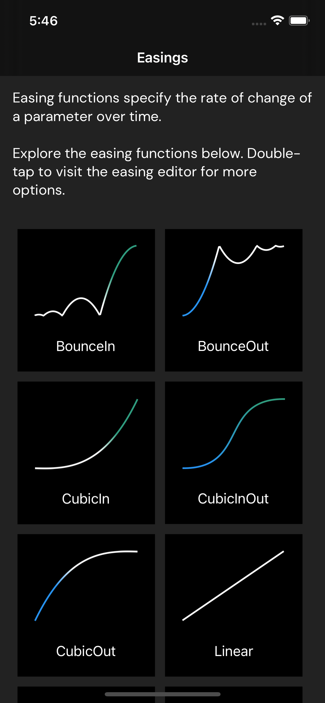
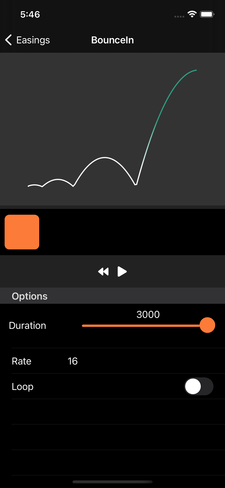

# Easings App

This is a Xamarin.Forms sample app inspired by [Easings.net](https://easings.net/).

In this sample I display a visualization of each easing and then present a simple editor with playback for that easing. Also included are many custom easing formulas not provided "out of the box" in Xamarin.Forms to demonstrate how easy it is to create and consume custom easing functions.

## Resources

* [Xamarin.Forms Easing](https://docs.microsoft.com/en-us/xamarin/xamarin-forms/user-interface/animation/easing)
* [Xamarin.Forms Animation](https://docs.microsoft.com/en-us/xamarin/xamarin-forms/user-interface/animation/)

## Screenshots

